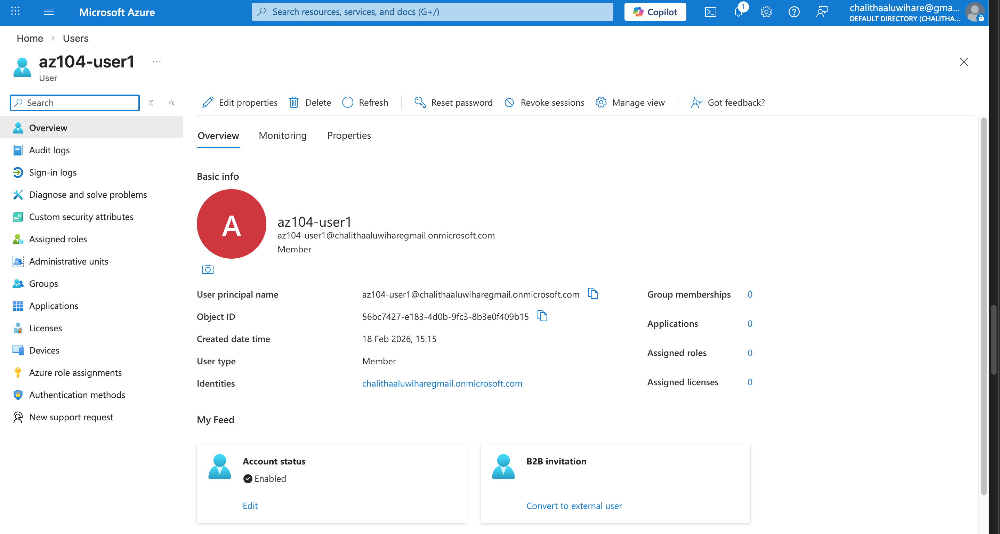
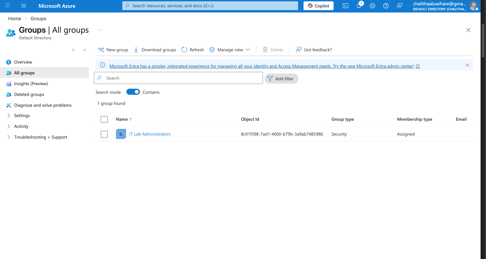

# Lab 01 – Manage Microsoft Entra ID Identities (AZ-104)

## Lab Introduction
This is the first lab in the AZ-104 Azure Administrator lab series.  
In this lab, I worked with **Users** and **Groups** in **Microsoft Entra ID** (Azure AD). Users and groups are the basic building blocks for an identity solution.

- **Estimated time:** ~30 minutes  
- **Region used in instructions:** East US
---

## Lab Scenario
My organization is building a new **pre-production lab environment** for testing apps and services.  
New engineers are being hired to manage the environment (including virtual machines). To allow engineers to authenticate using **Microsoft Entra ID**, I was tasked with:

- Provisioning users and groups  
- Reducing admin overhead by using **automatic group membership** (based on user properties like **Job title**)

---

## Architecture Diagram

## Lab 01 Screenshots

